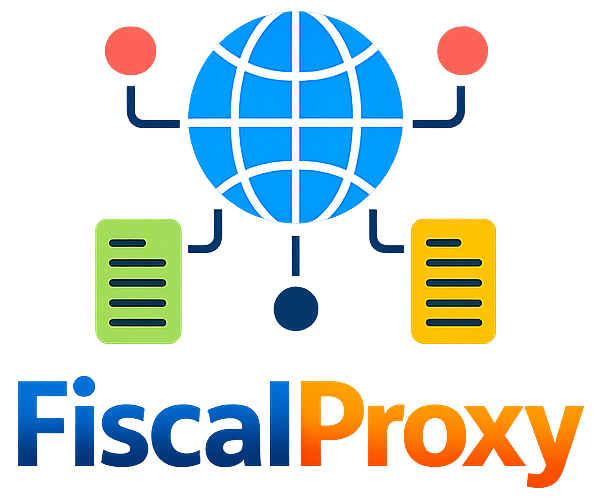

<!-- Adicione Badges das tecnologias que você usou aqui -->
<!-- Você pode encontrar badges aqui: https://github.com/Ileriayo/markdown-badges?tab=readme-ov-file#markdown-badges -->

**Este projeto está sendo desenvolvido com a finalidade de facilitar cenários no meio fiscal.**

# FiscalProxy

<!-- Substitua a seguinte imagem por uma logo do seu projeto -->

aaaaaaaaaaaaaaaaaaaaaaaaaaaaaaaaaaa
aaaaaaaaaaaaaaaaaaaaaaaaaaaaaaa

<!-- Substitua o seguinte parágrafo por um resumo do seu projeto: -->
FiscalProxy é um proxy intermediador para webservices fiscais (SEFAZ/DF-e) que permite interceptar, registrar, simular e manipular requisições e respostas, facilitando a reprodução de cenários, diagnóstico de bugs e testes controlados em integrações com NFe, CTe, NFCe e MDF-e.

## Sobre o autor

<!-- Coloque seu nome, uma foto sua e uma pequena bio sobre você na seguinte tabela: -->
|  |  |
|:-------------:|:------------------------------------------------------------:|
|    **Anthony Famar** | Nasci em Cuiabá em 22 de junho de 2000. Atualmente, sou estudante de Ciência da Computação e faço estágio como desenvolvedor. Meus dias são preenchidos com estudos para me tornar um programador e tenho como hobby a emoção de andar de moto, sair com amigos e me dedicar à academia. Essa mistura de paixões é o que torna minha jornada única e envolvente. |
